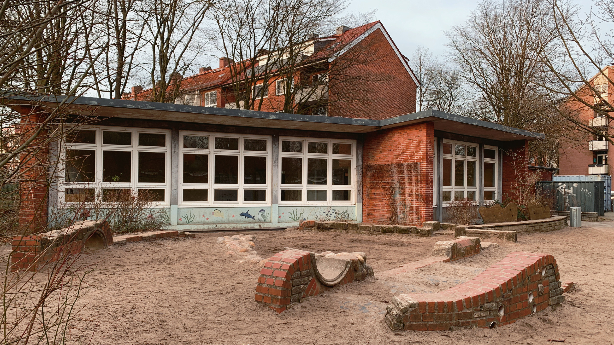

neues Zuhause

## das neue Zuhause der KiVi

Nach etlichen Gesprächen mit der Sozialbehörde und der Evangelischen Kirchengemeinde Eimsbüttel, die Vermieterin des ursprünglichen Standortes ist, zeichnete sich Anfang des Jahres 2024 endlich eine Lösung ab. Ein zurzeit leerstehender Pavillon auf dem Gelände der Grundschule Eduardstraße wird das neue Zuhause der KiVi.

  

Das Gebäude muss allerdings auf eigene Kosten saniert werden und der Mietvertrag ist auf fünf Jahre befristet. Trotzdem ist die Freude groß. Vor allem für die Eltern von Kindern mit Förderbedarf ist die Nachricht eine große Erleichterung.

Das Team ist nun schon mitten in der Planung die neuen Räumlichkeiten für die Kinder zu gestalten wollen Auch für inklusive Spielmöglichkeiten auf dem großzügigen Außengelände gibt es schon Ideen.  
 

Spenden

## Wir sind auf Spenden angewiesen

Finanziell haben sich die Vorstände seit Jahren auf diese Situation vorbereitet. Aber wir sind eine soziale Einrichtung und sind in dieser Phase auf Spenden angewiesen.

Wir hoffen auf finanzielle Unterstützung von Unterstützer*innen aus dem Viertel, um unseren KiVi-Kindern ein schönes neues Zuhause zu schaffen!

### Dein Beitrag für Inklusion in Eimsbüttel

<a href="https://www.betterplace.org/de/projects/136879-rettet-die-kivi-unterstuetze-den-neuanfang" class="profile" target="_blank">

Spende auf betterplace.org
</a>

Kitaplätze

## Neue Kinder in der KiVi willkommen

Tatsächlich gibt es nach der langen Zeit der Unsicherheit noch freie Plätze für einige Kinder, vor allem mit dem Geburtsjahr 2021 und 2022. Meldet Euch, wenn Ihr Interesse habt. 

### Alle Infos hier:

<a href="https://www.kitakivi.de" class="profile" target="_blank">

www.kitakivi.de
</a>

## Langfristige Perspektive für die KiVi im Viertel

Auch nach Ablauf der fünf Jahre in der Eduardstraße zeichnet sich eine Perspektive für die KiVi im Viertel ab. „Wir sind sehr hoffnungsvoll, dass ein Bauvorhaben, das unsere Kita als Mieterin mit einplant bis dahin realisiert wird“, sagt die stellvertretende Leitung Anke Wortmann. 
 

Bis die neuen Räumlichkeiten in der Eduardstraße wirklich bezugsfertig sind, hat die Evangelische Gemeinde den Verbleib der KiVi im alten Pastorat in der Fruchtallee zugesagt, auch wenn die Baumaßnahmen bis zum Ablaufdatum des Mietvertrags nicht beendet sein sollten.

